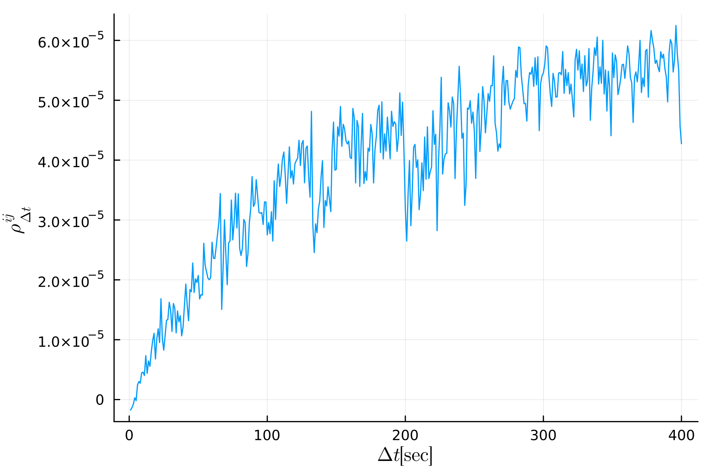
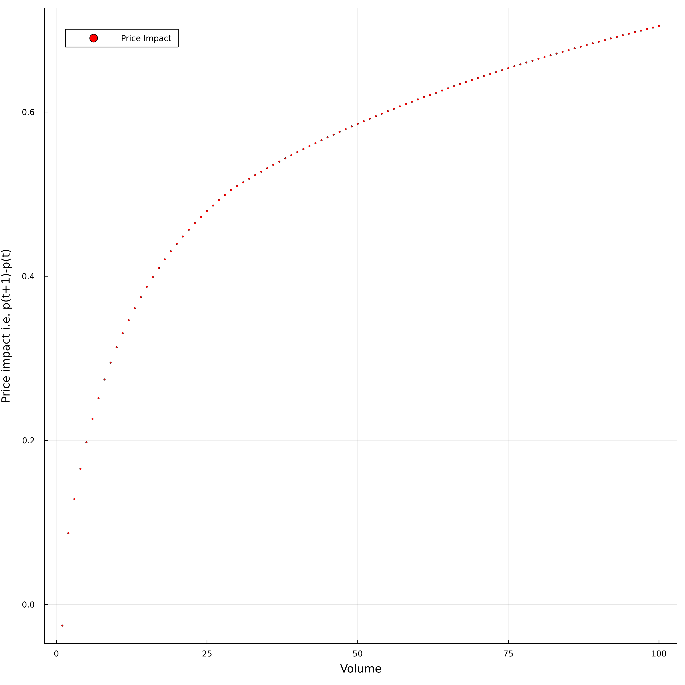
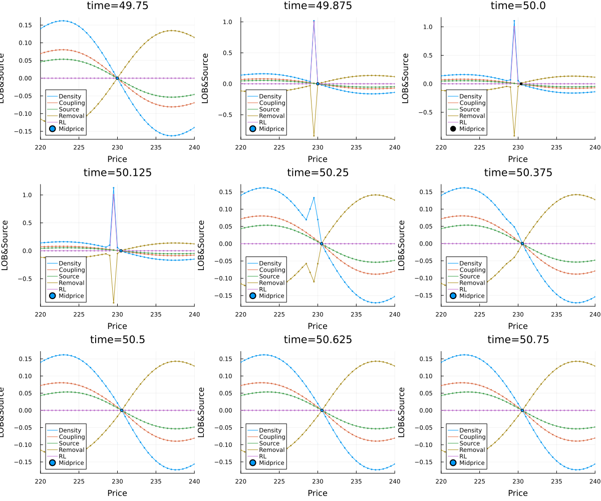

# Required plots

1. Figure: Epps plots for the simulation paths with average envelopes.

2. Figures : Plot of price impact for both order books when one order book is shocked. when both order books are shocked.

    - One order book is shocked

    - Both order books are shocked

3. Figures  : Time snap shots of the 8 square images of order books snap shots for both order books when the one order book is shocked with an order of size Q.

4. Figures  : A plot with at least 3 different Epps curves and envelopes for different choices of $\Delta t$ and fixed $\Delta x$.

5. Figures  : A plot with at least 3 different Epps curves for different choices of $\Delta x$ and fixed $\Delta t$.

6. Tables: With the calibrated model parameters using the NM-TA method (method of simulated moments).
